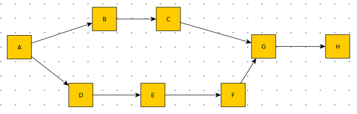

## 工作流定义文件格式标准 ##

### 数据需求 ###

工作流的定义分成如下几部分：

 * 工作流基本信息(General)
    * 工作流名称
    * 描述
 
 * 工作流活动列表(Tasks)
     * 该工作流上的部活动结点列表。每个活动需要有一个唯一的ID标识。
	* 每个活动结点的定义为map形式。需要支持下面的字段：
		* klass, 实例化的类名，比如 SimpleTask, JoinTask之类，
		  如果是用户的类，需要示记全路径。比如my.custom.in.the.project.EmailTask
		* name, 唯一名称，流向定义中需要使用这个名称
		* abbr, 唯一简称，一般用字母，流向定义中也可以使用这个名称
		* 其他附加的属性，根据TaskSpec类型不同，可以支持不同的参数，
		  实例化之后，如果存在相应的property,则更新之。

 * 工作流流向定义(Flows)
	* 采用图形化的形式定义结点与结点之间的关系。
	* ```A-->B-->C``` 的形式，表示A是B结点的输入结点，B是C的输入结点，支持多行定义。
	  ``-->`` 前后可以包含空格。方便多行定义的时候，做适当的对齐。
      可以参看后面的示例。
 
 * 工作流活动自定义逻辑片断(Code)
	* 对于部分简单的逻辑时，我们不需要定义新的TaskSpec子类。
	  可能需要覆盖部分函数，支持在工作流的配置中直接填写（只需填写方法体）
      __(TODO:可以覆盖的方法名称待定)__

### 流向定义示例 ###

如下图的工作流，



我们可以采用两种形式，定义，一种是链式，一次定义多个关系：

	A-->B-->C-->G-->H
	A-->D-->E-->F-->G


或者每行只定义一个流向，如下：
    
    A-->B
    A-->D
    B-->C
    C-->G
    D-->E
    E-->F
    F-->G
    G-->H

### 配置文件格式的构想 ###

一种形式是Ini文件的方法，分成多个Section, 分别定义不同的部分。
嵌入python代码的部分，需要使用"""的python换行文件的形式。

    [General]
    name=Workflow01
    description=示例工作流
    
    [Tasks]
    {name:”TaskA”, abbr:”A”, klass: “StartTask”,…}
    {name:”TaskB”, abbr:”B”, klass: “SimpleTask”}
    {name:”TaskC”, abbr:”C”, klass: “SimpleTask”}
    
    [Flows]
    A-->B-->C-->G-->H
    A-->D-->E-->F-->G
    
    [Code]
    >>A.ready
    if data.get(“is_superuser”) == True:
      return “B”
    else:
      return “C”
    >>TaskB.ready
    
另外一种，就是类似于写一个Python的类的样式 (缩进形式，关键字workflow, task, flow…)，
可以在一个文件中定义多个工作流。示例如下：

    workflow 
		general name Workflow01
    	general description=“示例工作流”
    	general xxx=”bbb”
    	task 
			name:”TaskA”, abbr:”A”, class: “StartTask”
		end task
    	task 
			name:”TaskB”, abbr:”B”, class: “SimpleTask”
		end task

    	flow A-->B-->C-->G-->H
    	flow A-->D-->E-->F-->G

    	code A.ready
    		if data.get(“is_superuser”) == True
    			return “B”
			else:
    			return “C”
	end workflow
    
    workflow
    	...
	end
    

### 配置读取的API形式 ###

两种形式，一种是配置文件使用固定的文件名称前缀，uliweb project启动的时候，
一次性全部加载。后继的使用中的时候，使用

	WorkflowSpec.loadByName(worlflow_name)

的API，根据工作流名称加载。

另外一种，是直接每次使用的时候，直接读取，比如
	
	WorkflowSpec.loadFromFile(filePath, workflow_name)


对于每一个工作流，读取文件（数据库?)后，生成的中间数据为如下形式的
Python数据，后面，会使用这些数据来生成实例化的WorkflowSpec对象。
	
 * properties, dict对象
 	* 存储直接生成到workflowSpec对象上的属性值。
    * 形如：{'name': 'Workflow01', 'description': '...'}  
 * tasks, 数组对象，
    * 每个Item为一个dict，表示一个活动结点。
    * dict 用来存储每个活动对象TaskSpec上的属性值。
 	* 形如：[{name:"TaskA", abbr:"A", klass: "StartTask"},...]
 * flows, 数组对象
    * 数据的元素是一个二元tuple,
    * 每个item表示一条流向
    * 形如下[('A','B'), ('A', 'C')]
 * snippets, 数组对象
    * 每个item表示一个对TaskSpec实例的函数覆盖
    * 每个item是一个三元tuple, 分名是 活动名，函数名，函数体
    * 形如[('A', 'ready', '.....'), ('B', 'ready', '....')] 


